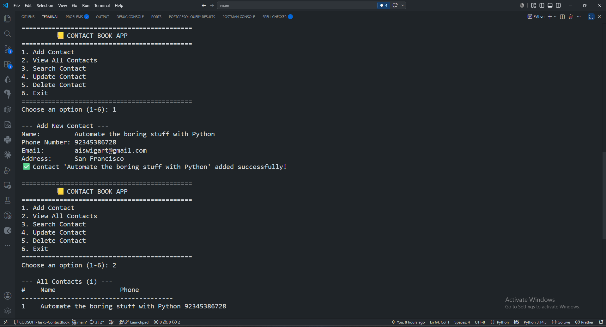

# 📒 Contact Book Application


> A fully-featured command-line **Contact Book** application built with Python to add, view, search, update, and delete contacts with full details like name, phone, email, and address.
> Developed as part of the **CodSoft Python Programming Internship — Task 5**.

---

## 📌 Table of Contents

- [📒 Contact Book Application](#-contact-book-application)
  - [📌 Table of Contents](#-table-of-contents)
  - [📖 About the Project](#-about-the-project)
  - [✨ Features](#-features)
  - [🛠️ Technologies Used](#️-technologies-used)
  - [📁 Folder Structure](#-folder-structure)
  - [▶️ How to Run](#️-how-to-run)
    - [Prerequisites](#prerequisites)
    - [Steps](#steps)
  - [💻 Usage](#-usage)
    - [➕ Add a Contact](#-add-a-contact)
    - [📋 View All Contacts](#-view-all-contacts)
    - [🔍 Search a Contact](#-search-a-contact)
    - [🗑️ Delete a Contact](#️-delete-a-contact)
  - [📸 Screenshots](#-screenshots)
  - [](#)
  - [👤 Author](#-author)
  - [📄 License](#-license)
  - [🏷️ Tags](#️-tags)

---

## 📖 About the Project

A **Contact Book** is a handy personal tool for storing and managing contact information. This Python command-line application provides full **CRUD** (Create, Read, Update, Delete) functionality. Users can store names, phone numbers, emails, and addresses — and quickly search or update any contact at any time.

This is **Task 5** of the CodSoft Python Programming Internship.

---

## ✨ Features

| Feature            | Description                               |
| ------------------ | ----------------------------------------- |
| ➕ Add Contact     | Store name, phone, email and address      |
| 📋 View All        | Display all contacts in a formatted list  |
| 🔍 Search          | Find contacts by name or phone number     |
| ✏️ Update          | Edit any contact detail including phone   |
| 🗑️ Delete          | Remove a contact with confirmation prompt |
| ⚠️ Duplicate Check | Prevents duplicate phone number entries   |
| ❌ Validation      | Required field checks and error messages  |
| 🔄 Loop Menu       | Continuous menu until the user exits      |

---

## 🛠️ Technologies Used

- **Language** — Python 3.x
- **Modules** — No external libraries required (pure Python)

---

## 📁 Folder Structure

```
CODSOFT-Task5-ContactBook/
├── task5_contact_book.py
└── README.md
```

---

## ▶️ How to Run

### Prerequisites

- Python 3.x must be installed → [Download Python](https://www.python.org/downloads/)

### Steps

```bash
# Step 1: Clone the repository
git clone https://github.com/limaraniray/CODSOFT-Task5-ContactBook.git

# Step 2: Navigate into the folder
cd CODSOFT-Task5-ContactBook

# Step 3: Run the application
python task5_contact_book.py
```

---

## 💻 Usage

```
=============================================
         📒 CONTACT BOOK APP
=============================================
1. Add Contact
2. View All Contacts
3. Search Contact
4. Update Contact
5. Delete Contact
6. Exit
=============================================
Choose an option (1-6):
```

### ➕ Add a Contact

```
--- Add New Contact ---
Name:         John Doe
Phone Number: 01712345678
Email:        john@example.com
Address:      Dhaka, Bangladesh

✅ Contact 'John Doe' added successfully!
```

### 📋 View All Contacts

```
--- All Contacts (2) ---
#    Name                 Phone
----------------------------------------
1    John Doe             01712345678
2    Jane Smith           01898765432
```

### 🔍 Search a Contact

```
Search by name or phone: john

🔍 Found 1 result(s):

  ┌─────────────────────────────
  │  👤 Name:    John Doe
  │  📞 Phone:   01712345678
  │  🏠 Address: Dhaka, Bangladesh
  └─────────────────────────────
```

### 🗑️ Delete a Contact

```
Enter phone number of contact to delete: 01712345678
Are you sure you want to delete 'John Doe'? (y/n): y
🗑️ Contact 'John Doe' deleted!
```

---

## 📸 Screenshots

## 

## 👤 Author

**Lima Rani Ray**

- 🔗 LinkedIn: [Lima Rani Ray](https://www.linkedin.com/in/lima-rani-ray-4380a53a4/)
- 🐙 GitHub: [limaraniray](https://github.com/limaraniray)

---

## 📄 License

This project is licensed under the **MIT License**.
Feel free to use, modify, and distribute it.

---

## 🏷️ Tags

`#codsoft` `#python` `#internship` `#contactbook` `#crud` `#commandline` `#pythonproject`
